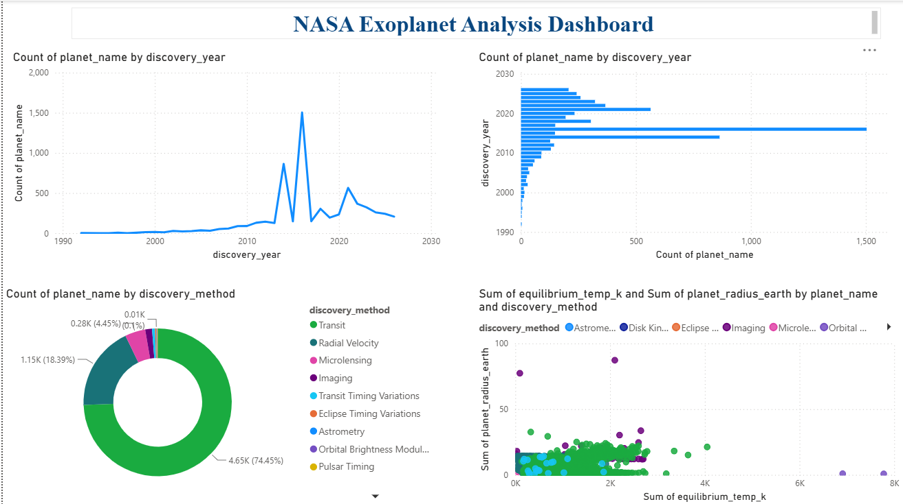
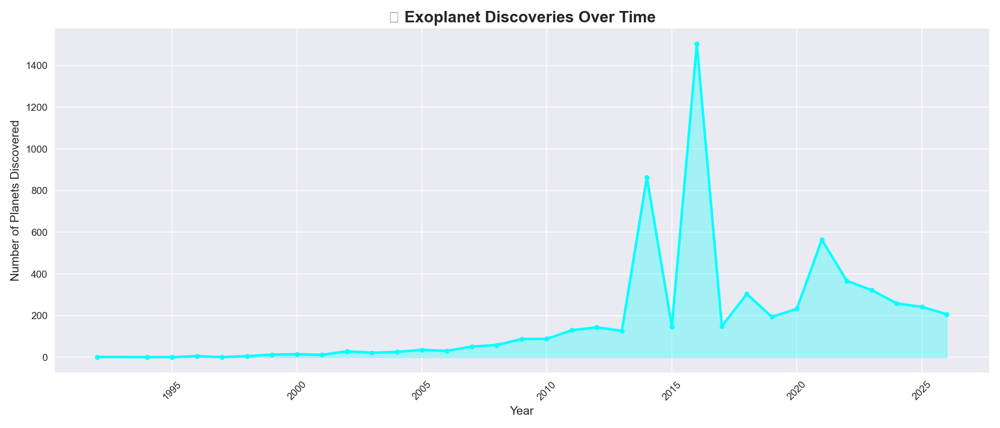
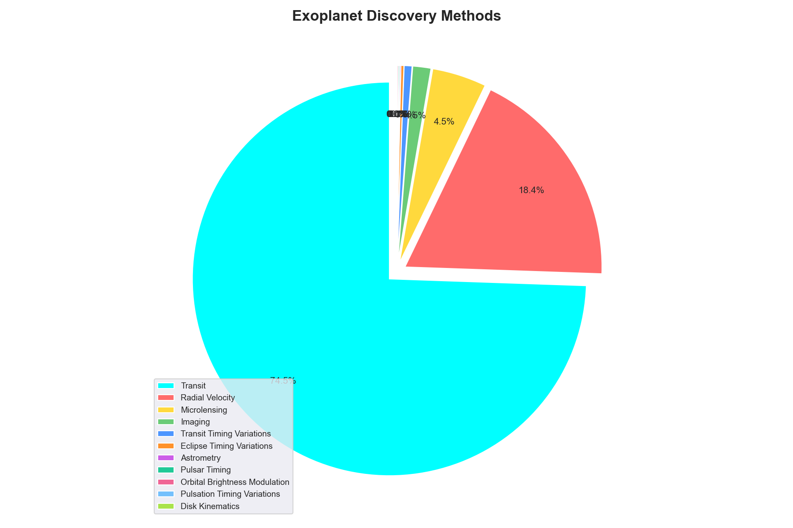
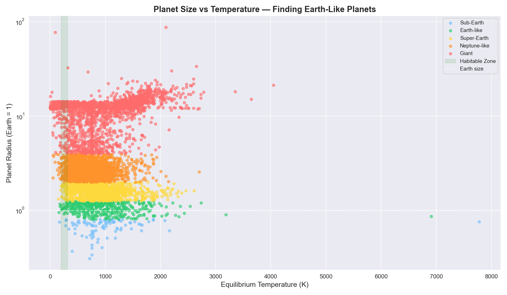
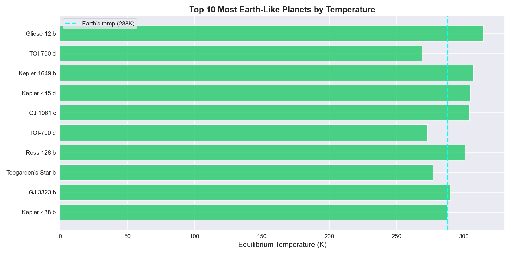

# 🚀 NASA Exoplanet Analysis

## Project Overview
Analysis of 6,247 confirmed exoplanets using real NASA data to find patterns 
in planetary discoveries and identify Earth-like planets that could support life.

## Tools Used
- Python (Pandas, Matplotlib, Seaborn)
- MySQL
- Power BI

## Key Findings
- 6,247 exoplanets analyzed from NASA archive
- 2016 was the biggest discovery year (1,504 planets — Kepler telescope peak)
- Transit method used to discover 74.45% of all exoplanets
- Only 18 planets out of 6,247 are truly Earth-like in habitable zone
- GJ 3323 b is the closest to Earth's temperature (288K)

## Project Structure
- `exoplanets.csv` — Raw NASA data
- `exoplanets_clean.csv` — Cleaned dataset (6,247 rows, 11 columns)
- `exploration.ipynb` — Data cleaning + Python visualizations
- `queries.sql` — SQL analysis queries
- `nasa_dashboard.pbix` — Power BI dashboard file

## Dashboard Preview

## Visualizations

## Data Source
NASA Exoplanet Archive — https://exoplanetarchive.ipac.caltech.edu